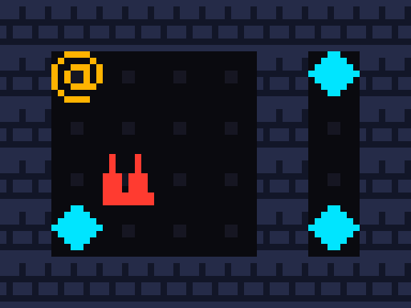

# bit-maze

[](https://www.rust-lang.org/)


A tile game where **the game world *is* binary**. Maps, items, triggers, logic,
sprites, and even recorded play sessions are packed bit-for-bit into files you
can open in a hex editor. The engine is a small, dependency-lean Rust host
running a custom stack-based bytecode VM ("BitVM"). The theme — *everything is 1s
and 0s* — is the architecture, not decoration.

Runs fully offline on Linux. No network at runtime, ever.

The feedback build also has a browser front end for the `trial` level. It parses
the same packed `.bm` bytes, renders the same 1-bit sprite patterns, and mirrors
the deterministic movement, collection, hazard, and one-shot-trigger rules.



*The trial level rendered by the engine itself: walls, collectible bits, a
one-shot trigger, and a hazard are all loaded from the packed `.bm` file.*

A hand-authored 8×8 level is exactly 16 bytes:

```
42 4d 01 00 08 08 01 00   BM, v1, flags=0, 8x8, 1 plane
ff 81 bd a5 af 81 fb ff   the maze, one byte per row (MSB = leftmost tile)
```

## The "everything is bits" philosophy

Every artifact in bit-maze is a small, versioned, hex-editable binary file:

- **Levels** are bitplanes. Plane 0 is walls, plane 1 is items, plane 2 is
  hazards — one bit per tile. Adding a mechanic is *adding a plane*, not rewriting
  the engine.
- **Triggers** are a byte-per-tile plane indexing a script table of **BitVM
  bytecode** — the game's logic is data too. A trigger id with the high bit set is
  a *one-shot* plate (fires once); ids 1..127 repeat.
- **Sprites** are 1-bit bitmaps through a palette. No PNGs; a pixel is a bit.
- **Replays** are the input log packed at 2 bits per move. A whole play session
  is a binary file, and because the world is deterministic it replays exactly.

Any random bytes are a *valid* (if inert) program, because the VM is hard-capped
and every loader rejects malformed files loudly. That is what makes "mods are
just files" safe.

## File formats

| File   | Magic  | Spec                                | What it is                          |
|--------|--------|-------------------------------------|-------------------------------------|
| `.bm`  | `"BM"` | [`docs/FORMAT.md`](docs/FORMAT.md)  | a level: bitplanes + triggers + scripts |
| `.spr` | `"SP"` | [`docs/SPRITE.md`](docs/SPRITE.md)  | a 1-bit sprite                      |
| `.rec` | `"BR"` | [`docs/REPLAY.md`](docs/REPLAY.md)  | a deterministic replay (input log)  |

Every format starts with a magic number and a version byte, is little-endian,
and is validated to the exact byte. See also [`docs/VM.md`](docs/VM.md) (the
BitVM), [`docs/ASM.md`](docs/ASM.md) (the assembler), and
[`ROADMAP.md`](ROADMAP.md) (the full plan + non-negotiable design rules).

## Build

```sh
cargo build --release   # the only dependency is `minifb` for the window
```

### Browser feedback build

```sh
npm install
npm run dev              # open http://localhost:3000
npm run test:web         # parser + complete win/lose routes
```

The web front end supports W/A/S/D, arrow keys, and an on-screen direction pad.

## Testing

```sh
cargo test
```

The suite currently contains **111 passing tests** across binary format
validation, fuzz-style malformed input handling, the VM and assembler,
deterministic replay, rendering, triggers, hazards, and complete win/lose paths.

## CLI

```
bitmaze play  [--term] <level.bm>              play (graphical window, or --term terminal)
bitmaze play --term --record <run.rec> <level.bm>   record your inputs to a .rec
bitmaze play --replay <run.rec> <level.bm>          replay a .rec, print the final state
bitmaze dump  <level.bm>                       ASCII-art every plane + trigger map (the debugger)
bitmaze check <level.bm>                       validate all invariants, exit nonzero on bad
bitmaze new   <w> <h> <out.bm>                 generate a sample walls-only level
bitmaze gen-levels <dir>                       write the built-in sample levels (walls + items)
bitmaze shot  <level.bm> <out.ppm> [tile_px]   render a level to a viewable P6 PPM image
bitmaze asm   <in.asm> <out.bin>               assemble a script to raw bytecode
bitmaze sprite <file.spr>                      dump a 1-bit sprite as ASCII (# ink / . paper)
bitmaze sprite gen <dir>                       write the three default sprites into <dir>
```

### Examples

```sh
cargo run -- dump  levels/garden.bm            # see the walls + items + trigger planes
cargo run -- check levels/garden.bm            # validate it
cargo run -- shot  levels/garden.bm out.ppm    # render the real graphics to a PPM, no display
cargo run -- asm   scripts/gate.asm gate.bin   # text -> BitVM bytecode

# Play the garden headlessly: collect items, step on the plate to open the gate.
printf 'd\nd\ns\na\ns\ns\nw\nd\nd\nd\nd\nd\nq\n' | cargo run -- play --term levels/garden.bm

# Record a run, then reproduce its exact final state deterministically.
printf 'd\nd\ns\na\nq\n' | cargo run -- play --term --record run.rec levels/garden.bm
cargo run -- play --replay run.rec levels/garden.bm
```

### Playing

`bitmaze play <level.bm>` opens a **graphical window** (via `minifb`): walls,
floor, items, and the player render from 1-bit sprites through a palette. Move
with **W/A/S/D or the arrow keys**; **Esc/Q** (or closing the window) quits. This
needs a display.

On a headless machine, use `--term`: a line-buffered terminal loop over the *same*
world core (type a key + Enter; works over pipes). It draws the maze as ASCII —
`@` player, `#` wall, `^` hazard, `*` item, `.` floor — with a live score. Both
paths drive identical `World`/`step` logic; only the I/O shell differs. Stepping
onto an item collects it (score up); stepping onto a trigger tile runs its BitVM
script (e.g. opening a gate).

### Winning and losing (Phase 8)

- **Win**: collect **every** item in the level. When the score reaches the level's
  total item count, the game is *won* — the terminal prints `YOU WIN` and stops;
  the window logs it (and updates its title) and stays open. A level with **zero**
  items has no win condition: it is endless/sandbox play.
- **Lose**: step onto a **hazard** tile (hazards plane, plane 2). The game is
  *over* — the terminal prints `GAME OVER` and stops; the window logs it. Avoid
  the spikes.
- Once the game is won or lost, further moves are ignored (a documented no-op).
- Win/lose and the one-shot latch are pure, deterministic `World` state, so a
  `--replay` reproduces the exact final outcome (it prints `state WON`/`LOST`).

## Sample content

- `levels/first.bm` — the 16-byte hand-authored maze from the spec.
- `levels/door.bm` — a pressure-plate door (Phase 4 demo).
- `levels/garden.bm` — walls + 5 items + a plate whose `gate.asm` script opens a
  gate to the far half of the room.
- `levels/vault.bm` — walls + items + a plate whose `vault.asm` script uses the
  `LOAD`/`STORE` RAM opcodes before opening a vault.
- `levels/trial.bm` — the Phase 8 winnable/losable trial: walls + 3 items + a
  spike **hazard** + a **one-shot** plate (`trial.asm`) that opens a gate to the
  walled-off items. Collect all three while avoiding the spike to win; step on the
  spike to lose.

The garden/vault/trial levels are built by `src/samples.rs`, which embeds
assembler-produced bytecode into the `.bm` script table; regenerate them with
`bitmaze gen-levels levels`.

## Design rules (the guardrails)

Determinism is law (no floats/time/host-RNG; only a seeded xorshift `RAND`). The
VM is hard-capped (stack 64, RAM 256 B, 4096 instr/tick) so a bad script halts,
never hangs or crashes. Every format is versioned and magic-checked. The
assembler stays **≤300 lines** — when a script needs more, the fix is a *new
opcode*, never a new language feature. See [`ROADMAP.md`](ROADMAP.md) for the
full list.

## Status

**Feature-complete** — Phases 0–7 done, plus a **Phase 8** post-roadmap
expansion (the gameplay loop). Versioned `.bm`/`.spr`/`.rec` formats with
loaders/validators; `dump`/`check`/`new`/`gen-levels`/`shot` tooling; a pure
deterministic world core (walls, items, score, **hazards, win/lose state**);
terminal and `minifb` front-ends; the BitVM (21 opcodes, incl. `GET_HAZARD`) with
triggers and a **one-shot latch**; the ≤300-line assembler; 1-bit sprites +
palette; deterministic replays; and PPM screenshot export. See
[`docs/PROGRESS.md`](docs/PROGRESS.md).
